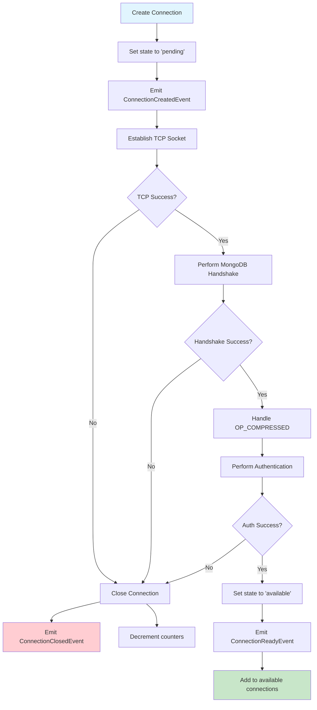

# CMAP Specification - UML Breakdown

This document provides a series of UML diagrams to visualize different aspects of the Connection Monitoring and Pooling (CMAP) specification.

## 1. Class Diagram - Core Components


## 2. State Diagram - Connection Lifecycle


## 3. State Diagram - Pool Lifecycle


## 4. Sequence Diagram - Successful CheckOut Flow


## 5. Sequence Diagram - Pool Clear Operation


## 6. Activity Diagram - Connection Establishment Process



## 7. Component Diagram - System Integration


## 8. Timing Diagram - Concurrent Operations

```mermaid
gantt
    title Connection Pool Timeline
    dateFormat X
    axisFormat %L ms
    
    section Thread 1
    CheckOut Request    :active, t1_req, 0, 50
    Wait in Queue      :t1_wait, 50, 150
    Use Connection     :active, t1_use, 150, 300
    CheckIn           :milestone, t1_in, 300
    
    section Thread 2
    CheckOut Request    :active, t2_req, 100, 125
    Wait in Queue      :t2_wait, 125, 300
    Use Connection     :active, t2_use, 300, 450
    CheckIn           :milestone, t2_in, 450
    
    section Pool State
    Available Conn: 1   :done, pool1, 0, 150
    Available Conn: 0   :crit, pool2, 150, 300
    Available Conn: 1   :done, pool3, 300, 450
    
    section Background
    Maintain minPoolSize :bg1, 0, 500
```

## Key Insights from UML Analysis

### 1. **State Management Complexity**
The state diagrams reveal that both connections and pools have well-defined state machines, but the interaction between them creates complexity in edge cases.

### 2. **Event-Driven Architecture**
The sequence diagrams show heavy use of events, making the system observable but potentially creating performance considerations.

### 3. **Concurrency Challenges**
The timing diagram illustrates how multiple threads compete for limited resources, highlighting the importance of fair queuing.

### 4. **Layered Responsibility**
The component diagram shows clear separation of concerns, with CMAP focusing purely on connection lifecycle management.

### 5. **Error Propagation Paths**
Multiple diagrams show various failure points and how errors propagate through the system, emphasizing the need for robust error handling.

## Usage Notes

- These diagrams are complementary - each captures a different aspect of the system
- The state diagrams are particularly important for understanding valid transitions
- The sequence diagrams help understand the temporal aspects and event ordering
- The component diagram shows integration points with other MongoDB specifications
